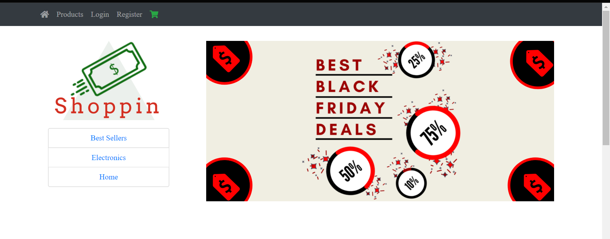
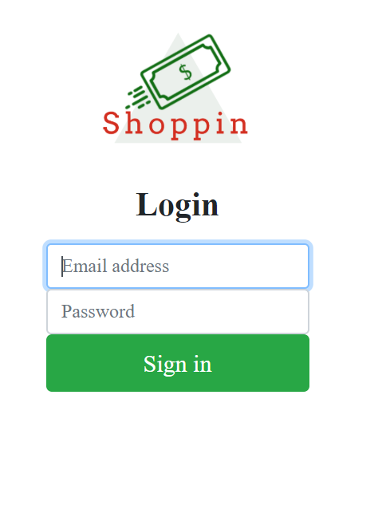

# Ecommerce Store

Store is fully functional and has a designated user, store clerk, who can do CRUD operations in cloud storage [MongoDB Atlas](https://www.mongodb.com/cloud/atlas).

Table of contents
=================

<!--ts-->
   * [gh-md-toc](#gh-md-toc)
   * [Table of contents](#table-of-contents)
   * [Installation](#installation)
   * [Usage](#usage)
      * [STDIN](#stdin)
      * [Local files](#local-files)
      * [Remote files](#remote-files)
      * [Multiple files](#multiple-files)
      * [Combo](#combo)
      * [Auto insert and update TOC](#auto-insert-and-update-toc)
      * [GitHub token](#github-token)
   * [Tests](#tests)
   * [Dependency](#dependency)
<!--te-->

## Main Technologies
  *  [NodeJs](https://nodejs.org/en/)
  *  [Express](https://expressjs.com/)
  *  [Handlebars](https://handlebarsjs.com/)
  *  [Bootstrap 4](https://getbootstrap.com/)
  *  [MongoDB Atlas](https://www.mongodb.com/cloud/atlas)
  *  [Heroku](https://www.heroku.com)

## Main Page
- Designed the logo on [LogoMakr](https://logomakr.com/) 
- Banner on [Canva](https://www.canva.com/)
- Used Bootstrap 4 throughout the website.
  

## Register Page
- Once user submits the form designated account gets created.
- User's password will be stored in hashed format, ensuring security of the customer.
- User recieves an email indicating he/she has successfully created an account.
  - Used [Twilio SendGrid](https://sendgrid.com/marketing/sendgrid-services-cro/?extProvId=5&extPu=49397-gaw&extLi=129987582&sem_adg=6157755102&extCr=6157755102-208633077262&extSi=&extTg=&keyword=send%20grid&extAP=&extMT=e&utm_medium=cpc&utm_source=google) API.

## Login Page
- Registered uers can login the website.
- They will be redirected to the dashboard.
  
 

## Admin Dashboard
- Once administrator logs in, he/she will be directed to the dashboard page.
- With the form admin can create a product with desired image  which then will be stored in NoSQL database.

## Products Page
- Everyone can add products on their cart.
- Items on the cart will stay even user shuts the website
  - Integrated the functionality using cookies.
  - If they preceed to not open the website, session will be deleted in 5 minutes.
  

## Product Page
- Shows the details of the product.

## Shopping Cart
- Has all the functionality a normal shopping cart has.
  
